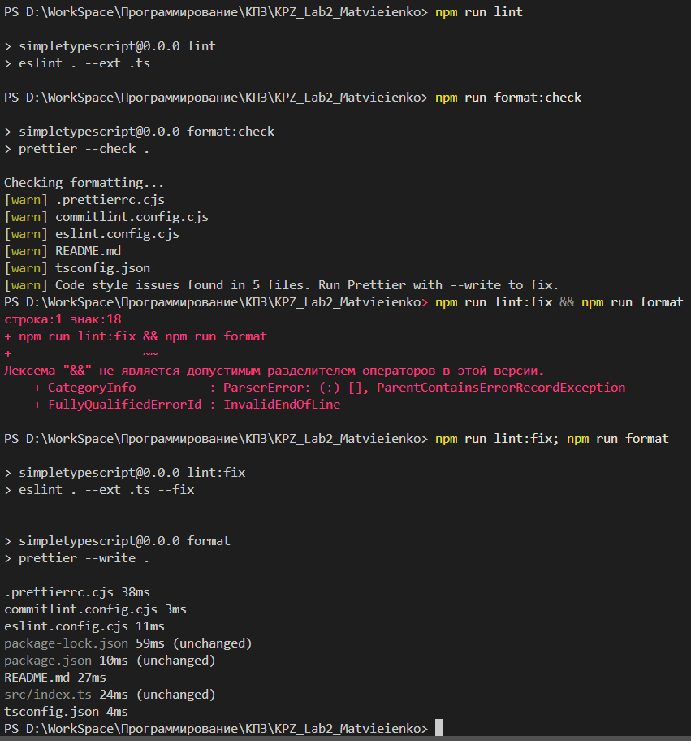
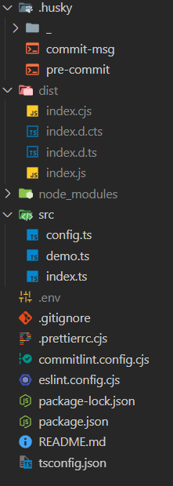

# KPZ_Lab2_Matvieienko

Lab2 (Simple project)

Конструювання Програмного Забезпечення (КПЗ)

Студентка: Матвєєнко Олександра  
Група: ІПЗ-3.03

---

## Опис проекту

Цей навчальний проєкт є простою демонстраційною бібліотекою, створеною в межах дисципліни **«Конструювання програмного забезпечення (КПЗ)»**

Мета роботи — ознайомитися з базовою структурою Node.js-проєкту, принципами **семантичного версіонування (SemVer)**, налаштуванням середовища розробки та використанням TypeScript

## Інструкції з запуску

```bash
# Клонування репозиторію
git clone https://github.com/Allaandra/KPZ_Lab2_Matvieienko.git
cd KPZ_Lab2_Matvieienko

npm i                # Встановлення залежностей
npm run demo         # Запуск демонстраційного прикладу
npm run build        # Збірка проекту

#---

# Перевірка типів, лінтингу та форматування
npm run typecheck
npm run lint
npm run format:check

# Форматування (за потреби)
npm run format
```

На кожному етапі виконуються перевірки. Husky-хуки спрацьовують перед комітом і не дозволяють зберегти код із помилками  


## Структура проєкту

```
KPZ_Lab2_Matvieienko/
├─ src/
│  ├─ index.ts       ← точка входу бібліотеки
│  ├─ demo.ts        ← приклади викликів (помилки → виправлення)
│  └─ config.ts      ← зчитування .env + валідація через zod (0.5.0+)
├─ .env              ← локальний (у .gitignore)
├─ .gitignore
├─ package.json
├─ tsconfig.json
├─ eslint.config.cjs
├─ .prettierrc.cjs
├─ commitlint.config.cjs
├─ .husky/
│   ├─ pre-commit
│   └─ commit-msg
└─ dist/ (створюється після npm run build)
```



## Еволюція версій

- **MAJOR** — зміни, що порушують сумісність (breaking changes)
- **MINOR** — нові можливості без поломки API
- **PATCH** — дрібні виправлення

| Версія  | Тип зміни                  | Що додано / змінено                                                                                         | Чому піднялася саме ця частина версії           |
| :------ | :------------------------- | :---------------------------------------------------------------------------------------------------------- | :---------------------------------------------- |
| `0.0.0` | –                          | Клонування репозиторію, ініціалізація проєкту                                                               | –                                               |
| `0.1.0` | `MINOR` (початковий реліз) | Перші утиліти `add`, `capitalize` з параметрами типу `any`. Налаштовані ESLint, Prettier, Husky, Commitlint | З’явився базовий функціонал бібліотеки          |
| `0.2.0` | `MINOR`                    | Переписано `add` і `capitalize` з явними типами (`number`, `string`) замість `any`                          | Сумісність не порушено, лише посилено типізацію |
| `0.3.0` | `MINOR`                    | Додано `formatNumber` і тип `NumberFormatOptions`. Підключено `.env` через `dotenv`                         | Нова функціональність без breaking changes      |
| `0.4.0` | `MINOR`                    | Додано `interface User` і generic-функцію `groupBy<T>(arr, key)`                                            | Розширення API без змін існуючих сигнатур       |
| `0.5.0` | `MINOR`                    | Додано клас `Logger`, валідацію `.env` через `zod`, `formatNumber` бере точність з `APP_PRECISION`          | Нові можливості без порушення сумісності        |
| `1.0.0` | `MAJOR`                    | Зафіксовано публічний API, додано `exports`, `types`, `dist/`, заборонено `any`, стабілізовано лінт-правила | Стабільний офіційний реліз бібліотеки           |
| `2.0.0` | `MAJOR` (breaking change)  | Змінено сигнатуру `add`: тепер приймає `number[]` замість двох чисел. Старі виклики ламаються               | Порушено зворотну сумісність → піднято `MAJOR`  |

> 🏷️ Кожен реліз створювався через `npm version`  
> (`npm version minor` або `npm version major`) з тегом `git push --follow-tags`

## Приклади використання

### Функція add

```javascript
import { add } from './utils';
const result = add(5, 3); // 8
```

### Функція capitalize

```javascript
import { capitalize } from './utils';
const text = capitalize('hello world'); // "Hello world"
```

### Функція formatNumber

```javascript
import { formatNumber } from './utils';
const formatted = formatNumber(1234567); // "1,234,567"
```

### Функція groupBy

```javascript
import { groupBy } from './utils';
const data = [
  { category: 'fruit', name: 'apple' },
  { category: 'vegetable', name: 'carrot' },
  { category: 'fruit', name: 'banana' },
];
const grouped = groupBy(data, 'category');
// { fruit: [...], vegetable: [...] }
```

### Клас Logger

```javascript
import { Logger } from './logger';
const logger = new Logger();
logger.info('Інформаційне повідомлення');
logger.warn('Попередження');
logger.error('Помилка');
```

## Налаштування .env

Файл .env у кореневій директорії проекту (не пушиться в репозиторій) з наступними ключами:

```
APP_PRECISION=2
LOG_LEVEL=info
```

Ці змінні використовуються у:
`formatNumber()` — для точності форматування
`Logger` — для рівня логування

## Теги релізів

- [v0.1.0](https://github.com/Allaandra/KPZ_Lab2_Matvieienko/releases/tag/v0.1.0)
- [v0.2.0](https://github.com/Allaandra/KPZ_Lab2_Matvieienko/releases/tag/v0.2.0)
- [v0.3.0](https://github.com/Allaandra/KPZ_Lab2_Matvieienko/releases/tag/v0.3.0)
- [v0.4.0](https://github.com/Allaandra/KPZ_Lab2_Matvieienko/releases/tag/v0.4.0)
- [v0.5.0](https://github.com/Allaandra/KPZ_Lab2_Matvieienko/releases/tag/v0.5.0)
- [v1.0.0](https://github.com/Allaandra/KPZ_Lab2_Matvieienko/releases/tag/v1.0.0)
- [v2.0.0](https://github.com/Allaandra/KPZ_Lab2_Matvieienko/releases/tag/v2.0.0)
